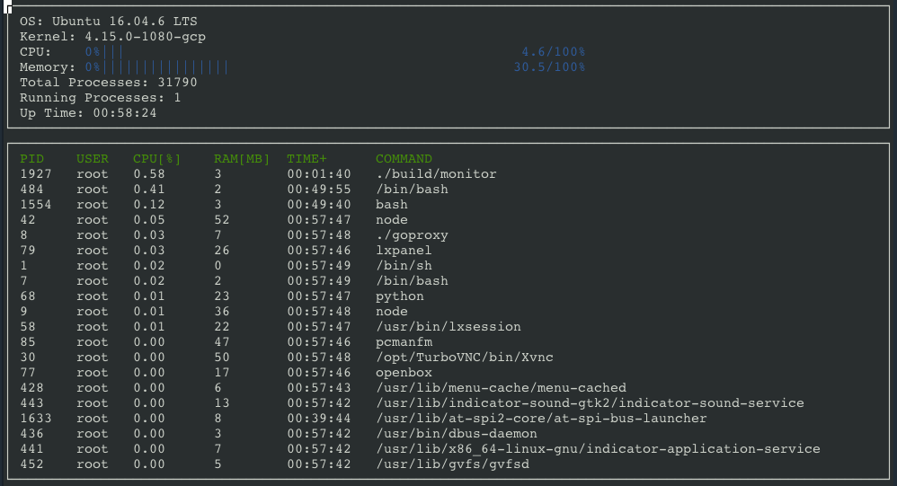

# System Monitor

This is a simple tool to show running processes on a Linux machine. It is based on the [starter code](https://github.com/udacity/CppND-System-Monitor) of a project in the Object Oriented Programming Course of [Udacity C++ Nanodegree Program](https://www.udacity.com/course/c-plus-plus-nanodegree--nd213). The code in our repository has been reviewed by one of Udacity's mentors. The main inspiration of this project is clearly [htop](https://github.com/htop-dev/htop).

## Installation 
The System Monitor depends on [ncurses](https://www.gnu.org/software/ncurses/). If it is not yet installed on your machine, please do so via `sudo apt install libncurses5-dev libncursesw5-dev`.

After that simply clone this repository and compile it via `make build` in the folder `System-Monitor`. For more details on the building process, see [Make](https://www.gnu.org/software/make/).

## Usage
The System Monitor is opened via `./build/monitor` (on a Linux machine). It shows the 
* OS (e.g. Ubuntu)
* kernel
* accumulated CPU usage 
* memory usage
* number of total and running processes
* up time
* a list of all running processes with CPU/memory usage etc. as in the screenshot below

## Implementation
All the information of a Linux system is stored in the *proc* pseudo-filesystem usually mounted at `/proc` (see [proc manual page](https://man7.org/linux/man-pages/man5/proc.5.html)). The heart of this project is a parser to read the relevant data from `/proc`(see [linux_parser.cpp](src/linux_parser.cpp)). The data of each process (e.g. CPU utilization or up time) are then stored in an instance of the class `Process`. Similarly, for each processor its utiliation is stored in a class instance of `Processor` (for simplicity we only work with the accumulated CPU utilization, hence only one class instance).
All these system data are saved in a class instance of `System`. It is essentially composed of the processors and a vector of all processes. 

Finally, printing the data of that class object to the terminal is done via `ncurses` which faciliatates text-based graphical output to the terminal.

## On the starter code
As alluded to above, the skeleton of this project was provided by Udacity. The main part was the output via `ncurses` and a small part of the `linux parser` yielding the following

